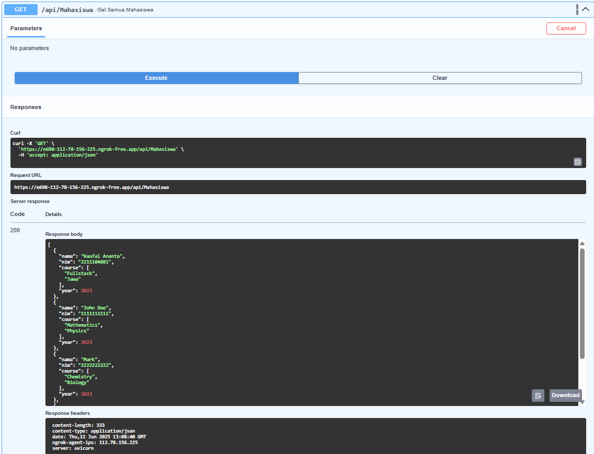
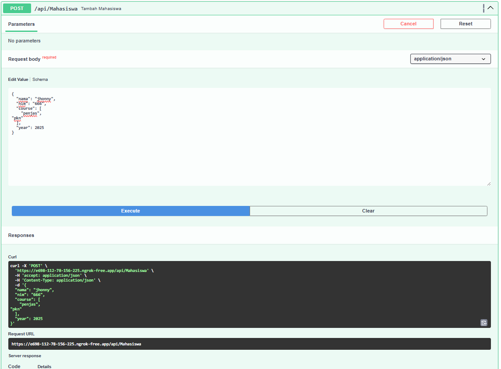
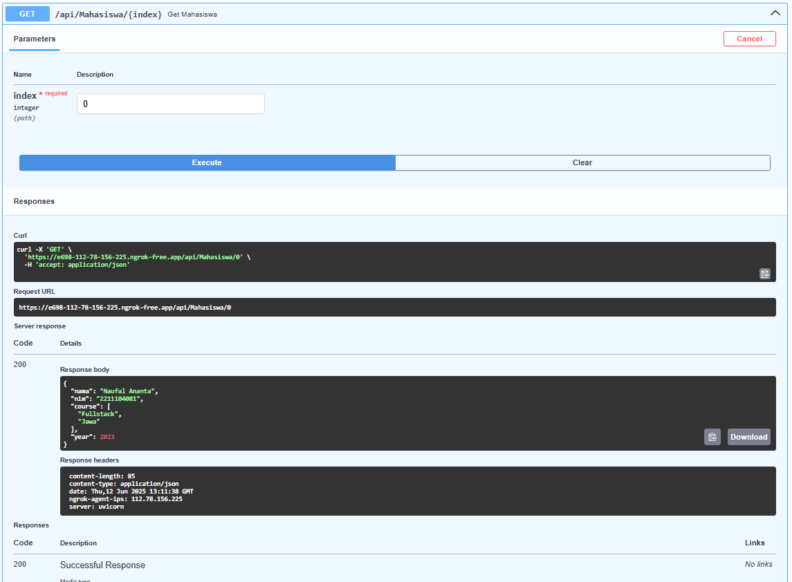
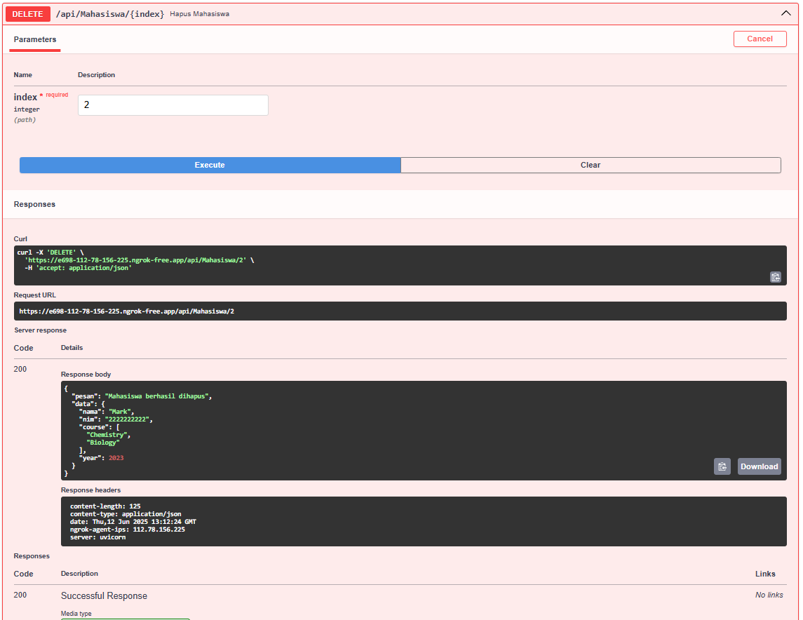

<div align="center">

**TUGAS JURNAL**  
**KONSTRUKSI PERANGKAT LUNAK**

**MODUL IX**  
**API DESIGN DAN CONSTRUCTION USING SWAGGER**


Disusun Oleh :

**Naufal Ananta (2211104081)**  
**SE-06-03**

Asisten Praktikum :  
Vaninside
rizqiiirz

Dosen Pengampu :  
riyandwwi

PROGRAM STUDI S1 REKAYASA PERANGKAT LUNAK  
FAKULTAS DIREKTORAT KAMPUS PURWOKERTO  
TELKOM UNIVERSITY PURWOKERTO  
2024

</div>

---

# TUGAS JURNAL

## A. Soal Nomor 1

Dari master/main branch dan class utama, buatlah program/aplikasi web API dari spesifikasi sebagai
berikut ini:
- API yang dibuat menggunakan data dari kelas Mahasiswa.
Mahasiswa
+ Name : string
+ Nim : string
+ Course : List<string>
+ Year: integer
+ Mahasiswa()
- API yang dibuat mempunyai lokasi sebagai berikut ‘/api/Mahasiswa, URL domain boleh
dari port mana saja (port bebas). Dengan menggunakan swagger API tersebut dapat
menerima RESTful API dengan metoda sebagai berikut (halaman swagger dapat diakses
pada https://localhost:<PORT>/swagger/index.html):

    - GET /api/Mahasiswa: mengembalikan output berupa list/array dari semua objek
Mahasiswa
    - GET /api/Mahasiswa/{id}: mengembalikan output berupa objek Mahasiswa untuk
index “id”
    - POST /api/Mahasiswa: menambahkan objek Mahasiswa baru
    - DELETE /api/Mahasiswa/{id}: menghapus objek Mahasiswa pada index “id”
- Secara default, program yang dibuat memiliki list Mahasiswa yang berasal dari anggota
kelompok TUBES (minimal 3 data).
- Impementasi yang dibuat tidak menggunakan database, cukup disimpan sebagai suatu 
variable, dan gunakan “static” di variable tersebut yang menyimpan list/array dari objek-
objek Mahasiswa.
- Dalam pembuatan program/aplikasi ini, anda dapat mengasumsikan bahwa input dari user
selalu benar dan sesuai dengan tipe data yang diharapkan.
---
```py
# Import library
from fastapi import FastAPI
from pydantic import BaseModel
import nest_asyncio
from pyngrok import ngrok, conf
import uvicorn

# Inisialisasi FastAPI
app = FastAPI()

# Konfigurasi ngrok (ganti token dengan punyamu)
conf.get_default().auth_token = "2jFQGx5OeCHsBSZylzCsqblzJb3_3t3TBQXuyUPY9Tb3QoMPr"

# MODELS
class Mahasiswa(BaseModel):
    nama: str
    nim: str
    course: list[str]
    year: int 

# DATA MAHASISWA - isi sesuai anggota kelompok (nama kamu paling atas)
mahasiswa_list = [
    {"nama": "Naufal Ananta", "nim": "2211104081", "course": ["Fullstack", "Jawa"], "year": 2023},
    {"nama": "John Doe", "nim": "1111111111", "course": ["Mathematics", "Physics"], "year": 2023},
    {"nama": "Mark", "nim": "2222222222", "course": ["Chemistry", "Biology"], "year": 2023},
    {"nama": "Jane", "nim": "4444444444", "course": ["History", "Geography"], "year": 2023},

]

# ENDPOINTS
@app.get("/api/Mahasiswa")
def get_semua_mahasiswa():
    return mahasiswa_list

@app.get("/api/Mahasiswa/{index}")
def get_mahasiswa(index: int):
    if 0 <= index < len(mahasiswa_list):
        return mahasiswa_list[index]
    return {"error": "Index tidak ditemukan"}

@app.post("/api/Mahasiswa")
def tambah_mahasiswa(mahasiswa: Mahasiswa):
    mahasiswa_list.append(mahasiswa.dict())
    return {"pesan": "Mahasiswa berhasil ditambahkan"}

@app.delete("/api/Mahasiswa/{index}")
def hapus_mahasiswa(index: int):
    if 0 <= index < len(mahasiswa_list):
        deleted = mahasiswa_list.pop(index)
        return {"pesan": "Mahasiswa berhasil dihapus", "data": deleted}
    return {"error": "Index tidak ditemukan"}

# Jalankan server
nest_asyncio.apply()
public_url = ngrok.connect(3000)
print("🚀 Swagger UI:", f"{public_url.public_url}/docs")
print("🚀 API URL:", public_url.public_url)

uvicorn.run(app, port=3000)
```


**Output**

- GET /api/Mahasiswa



- POST /api/Mahasiswa



- GET /api/Mahasiswa/{index}



- DELETE /api/Mahasiswa/{index}



---