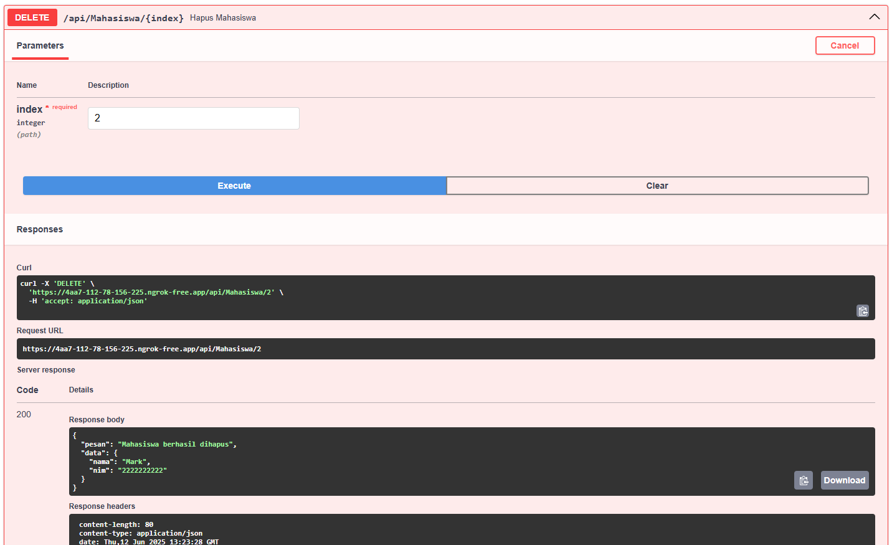

<div align="center">

**TUGAS PENDAHULUAN**  
**KONSTRUKSI PERANGKAT LUNAK**

**MODUL IX**  
**API DESIGN DAN CONSTRUCTION USING SWAGGER**


Disusun Oleh :

**Naufal Ananta (2211104081)**  
**SE06-03**

Asisten Praktikum :  
Vaninside
rizqiiirz

Dosen Pengampu :  
riyandwwi

PROGRAM STUDI S1 REKAYASA PERANGKAT LUNAK  
FAKULTAS DIREKTORAT KAMPUS PURWOKERTO  
TELKOM UNIVERSITY PURWOKERTO  
2024

</div>

---

# TUGAS PENDAHULUAN

## A. Soal Nomor 1

MEMBUAT PROJECT WEB API
Berhubung cara membuat project web api berbeda-beda untuk setiap bahasa pemrograman, langkah-
langkah berikut hanya berlaku apabila dilakukan dengan menggunakan .NET dan Visual Studio. Untuk
IDE dan bahasa pemrograman lain, yang terpenting adalah nama project yang dibuat yaitu
“modul8_NIM”.

- TP_9.ipynb

```py
# Import library
from fastapi import FastAPI
from pydantic import BaseModel
import nest_asyncio
from pyngrok import ngrok, conf
import uvicorn

# Inisialisasi FastAPI
app = FastAPI()

# Konfigurasi ngrok (ganti token dengan punyamu)
conf.get_default().auth_token = "2yPRn9m533gmyapGA2yq8s389tH_2rKv4GYcr8PVQqsUqsguQ"

# MODELS
class Mahasiswa(BaseModel):
    nama: str
    nim: str

# DATA MAHASISWA - isi sesuai anggota kelompok (nama kamu paling atas)
mahasiswa_list = [
    {"nama": "Naufal Ananta", "nim": "2211104081"},
    {"nama": "John Doe", "nim": "1111111111"},
    {"nama": "Mark", "nim": "2222222222"},
    {"nama": "Sarah", "nim": "3333333333"},
]

# ENDPOINTS
@app.get("/api/Mahasiswa")
def get_semua_mahasiswa():
    return mahasiswa_list

@app.get("/api/Mahasiswa/{index}")
def get_mahasiswa(index: int):
    if 0 <= index < len(mahasiswa_list):
        return mahasiswa_list[index]
    return {"error": "Index tidak ditemukan"}

@app.post("/api/Mahasiswa")
def tambah_mahasiswa(mahasiswa: Mahasiswa):
    mahasiswa_list.append(mahasiswa.dict())
    return {"pesan": "Mahasiswa berhasil ditambahkan"}

@app.delete("/api/Mahasiswa/{index}")
def hapus_mahasiswa(index: int):
    if 0 <= index < len(mahasiswa_list):
        deleted = mahasiswa_list.pop(index)
        return {"pesan": "Mahasiswa berhasil dihapus", "data": deleted}
    return {"error": "Index tidak ditemukan"}

# Jalankan server
nest_asyncio.apply()
public_url = ngrok.connect(8000)
print("🚀 Swagger UI:", f"{public_url.public_url}/docs")
print("🚀 API URL:", public_url.public_url)

uvicorn.run(app, port=8000)
```


**Output**


- GET /api/Mahasiswa


- POST /api/Mahasiswa


- GET /api/Mahasiswa/{index}


- DELETE /api/Mahasiswa/{index}

---