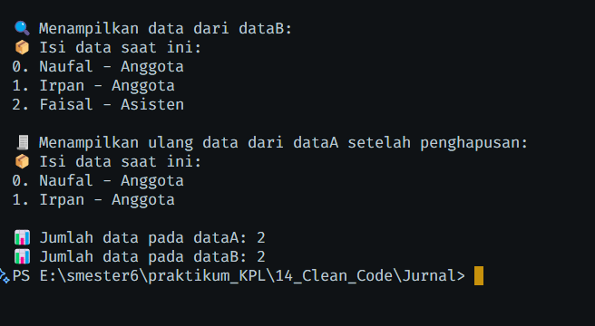

<div align="center">

**TUGAS JURNAL**  
**KONSTRUKSI PERANGKAT LUNAK**

**MODUL 14**  
**Refactoring Modul 14 – Implementasi Singleton Pattern pada ManajerData**


Disusun Oleh :

**Naufal Ananta (2211104081)**  
**SE-06-03**

Asisten Praktikum :  
Vaninside
rizqiiirz

Dosen Pengampu :  
riyandwwi

PROGRAM STUDI S1 REKAYASA PERANGKAT LUNAK  
FAKULTAS DIREKTORAT KAMPUS PURWOKERTO  
TELKOM UNIVERSITY PURWOKERTO  
2024

</div>

---

# TUGAS JURNAL

## A. Soal Nomor 1
A. MEMBUAT PROJECT MODUL
Buka IDE misalnya dengan Visual Studio
A. Copy salah satu folder tugas jurnal yang dimiliki sebelumnya (dari modul 2 sampai modul 13),
kemudian rename folder hasil copy-paste tersebut dengan modul14_NIM (coba pilih tugas
pendahuluan yang paling sederhana)
B. Misalnya menggunakan Visual Studio, bukalah project/folder yang di-copy sebelumnya.
## B. Soal Nomor 2
B. REFACTORING DENGAN STANDAR CODE
Dengan mengikuti standard code yang digunakan (misal C# dengan standar dari .NET), pastikan kode yang
dikumpulkan memenuhi faktor-faktor berikut:
A. Naming convention
i. Variable / Property / Attribute
ii. Method / Function / Procedure
B. White space dan indentation
C. Variable / attribute declarations
D. Comments
## C. Soal Nomor 3
C. PENGUMPULAN FILE/TUGAS JURNAL
A. Source code dari project yang dibuat
B. File docx/pdf yang berisi:
i. Screenshot hasil refactoring
ii. Penjelasan singkat dari kode implementasi yang dibuat (beserta screenshot dari potongan
source code yang dijelaskan).


## Input

- main.js

```js
// main.js
const ManajerData = require('./ManajerDataSingleton');

// Mendapatkan instance singleton pertama
const dataA = ManajerData.getInstance();

// Mendapatkan instance singleton kedua (harus sama dengan dataA)
const dataB = ManajerData.getInstance();

// Menambahkan data melalui dataA
dataA.tambahData("Naufal - Anggota");
dataA.tambahData("Irpan - Anggota");
dataA.tambahData("Faisal - Asisten");

// Menampilkan data melalui dataB (harus sama dengan dataA)
console.log("\n🔍 Menampilkan data dari dataB:");
dataB.tampilkanSemuaData();

// Menghapus data index ke-2 (Faisal - Asisten) melalui dataB
dataB.hapusDataBerdasarkanIndex(2);

// Menampilkan ulang data melalui dataA setelah penghapusan
console.log("\n🧾 Menampilkan ulang data dari dataA setelah penghapusan:");
dataA.tampilkanSemuaData();

// Menampilkan jumlah data melalui kedua instance
console.log(`\n📊 Jumlah data pada dataA: ${dataA.ambilSemuaData().length}`);
console.log(`📊 Jumlah data pada dataB: ${dataB.ambilSemuaData().length}`);
```

- ManajerDataSingleton.js

```js
// Singleton Class untuk mengelola data anggota
class ManajerDataSingleton {
    constructor() {
        if (ManajerDataSingleton.instance) {
            throw new Error("Gunakan getInstance() untuk mengakses singleton.");
        }

        this.kumpulanData = [];
        ManajerDataSingleton.instance = this;
    }

    // Mengambil instance tunggal
    static getInstance() {
        if (!ManajerDataSingleton.instance) {
            new ManajerDataSingleton();
        }
        return ManajerDataSingleton.instance;
    }

    // Menambahkan data ke dalam array
    tambahData(nama) {
        this.kumpulanData.push(nama);
    }

    // Menghapus data berdasarkan index
    hapusDataBerdasarkanIndex(index) {
        if (index >= 0 && index < this.kumpulanData.length) {
            this.kumpulanData.splice(index, 1);
        } else {
            console.log("Index tidak ditemukan!");
        }
    }

    // Menampilkan semua data
    tampilkanSemuaData() {
        console.log("📦 Isi data saat ini:");
        this.kumpulanData.forEach((data, i) => {
            console.log(`${i}. ${data}`);
        });
    }

    // Mengambil array kumpulan data
    ambilSemuaData() {
        return this.kumpulanData;
    }
}
```
Kode di atas menunjukkan bahwa dataA dan dataB sebenarnya mengacu pada instance yang sama. Ketika data ditambahkan melalui dataA, maka hasilnya juga akan muncul saat diakses melalui dataB.

## Output


---
